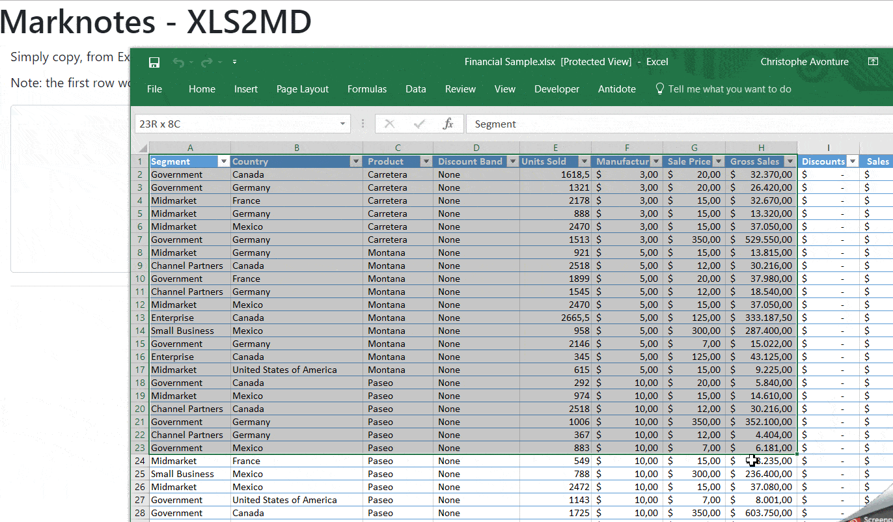

# marknotes_xls2md

> Excel raw table to markdown converter.

Simply copy, from Excel, a table and paste here to convert table to markdown.

## How to use

In Excel, select your table (f.i. the range `$A$1:$J:$50`), press <kbd>CTRL+C</kbd> and paste the clipboard in the textarea (press <kbd>CTRL+V</kbd>) to get the markdown rendering.

## Source

The javascript has been written by `Jonathan Hoyt` and available on GitHub: https://github.com/jonmagic/copy-excel-paste-markdown.

Updated to:

- Add a space character before `-` in the separator line
- Add a space character before and after the `|` value separator
- Call marked.js (https://www.npmjs.com/package/marked) to render the table from markdown to html
- Add bootstrap class to the rendered table
